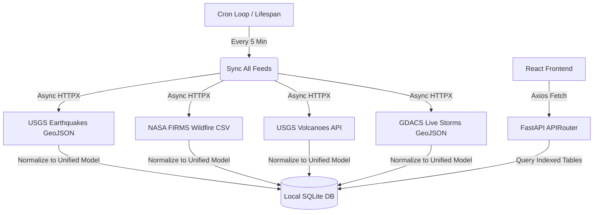

# ⚠ DisasterWatch

DisasterWatch is a high-performance, full-stack real-time disaster monitoring platform. It aggregates global hazard feeds—including earthquakes, wildfires, volcanic activity, and tropical cyclones—into a unified, interactive map dashboard featuring a tectonic plate boundary overlay.

Built with a fast **FastAPI** backend caching layer and a responsive **React (TypeScript) + Vite + Leaflet** frontend canvas.

---

## 🚀 Key Features

*   **Real-Time Hazard Feeds**:
    *   🌍 **Earthquakes**: Real-time seismology data queried directly from the **USGS Earthquake Hazards Program**.
    *   🔥 **Wildfires**: Parallelized ingestion of thermal hotspots detected by **NASA FIRMS** (MODIS & VIIRS satellites).
    *   🌋 **Volcanoes**: Weekly advisory status alerts from the **USGS Volcano Hazards Program** & key global targets.
    *   🌀 **Storms**: Live active tropical cyclone/hurricane tracking aggregated from **GDACS (NOAA/JTWC feeds)**.
*   **Tectonic Plate Boundaries**: Toggleable GeoJSON overlay of tectonic plate lines (Peter Bird PB2002 dataset) to illustrate the direct relationship between tectonic plate boundaries and seismic/volcanic events.
*   **Adaptive Map Zoom States**:
    *   *Low Zoom*: Smooth global heatmaps representing density and hazard concentration.
    *   *High Zoom*: Discrete, customized SVG-based vector markers representing individual hazards with detailed tooltips.
*   **Performance-Optimized Rendering**: Leverages Leaflet's HTML5 Canvas path rendering (`preferCanvas={true}`) to draw hundreds of items simultaneously without DOM lag.
*   **Local Caching & Background Sync**: Backend executes automatic parallel synchronizations every 5 minutes and caches entries in a local SQLite DB, protecting external feeds from rate-limiting and ensuring millisecond API response times.
*   **Analytics Dashboard**: A collapsable drawer displaying quick metrics, severity distributions, and a custom SVG bar chart illustrating earthquake magnitude clusters.

---

## 🛠️ Tech Stack

### **Backend**
*   **FastAPI**: High-performance, asynchronous Python web framework.
*   **SQLite**: Lightweight caching layer with optimized database indexes.
*   **HTTPX**: Asynchronous client for making parallel requests to USGS, NASA FIRMS, and GDACS feeds.
*   **Pydantic**: Data validation and serialization.

### **Frontend**
*   **React (TypeScript)**: Clean component-driven architecture.
*   **Vite**: Next-generation bundler for rapid development builds.
*   **React-Leaflet**: Leaflet abstraction mapping package.
*   **Tailwind CSS**: Sleek dark-themed UI styling.
*   **Framer Motion**: Smooth drawer sliding transitions and micro-animations.
*   **TanStack Query (React Query)**: Query caching, automatic refetching, and state management.

---

## ⚙️ Ingestion Architecture



---

## 🏁 Installation & Setup

### **Prerequisites**
*   Python 3.10+
*   Node.js 18+

### **Backend Configuration**
1. Navigate to the backend folder:
   ```bash
   cd backend
   ```
2. Create and activate a virtual environment:
   ```bash
   python -m venv venv
   # On CMD
   venv\Scripts\activate
   # On PowerShell
   .\venv\Scripts\Activate.ps1
   ```
3. Install dependencies:
   ```bash
   pip install -r requirements.txt
   ```
4. Configure environment variables. Copy `.env.example` to `.env` and fill in your NASA FIRMS key (optional, for active fire data):
   ```env
   NASA_FIRMS_KEY=your_nasa_firms_api_key
   CORS_ORIGINS=http://localhost:5173
   ```

### **Frontend Configuration**
1. Navigate to the frontend folder:
   ```bash
   cd ../frontend
   ```
2. Install dependencies:
   ```bash
   npm install
   ```

---

## 🏃 Running the Project

Ensure you have two terminals open:

### **Terminal 1: Backend Server**
```bash
cd backend
# Activate virtual environment
venv\Scripts\activate  # CMD
.\venv\Scripts\Activate.ps1  # PowerShell

# Start Uvicorn
uvicorn app.main:app --host 127.0.0.1 --port 8000 --reload
```
The FastAPI documentation is available at [http://127.0.0.1:8000/docs](http://127.0.0.1:8000/docs).

### **Terminal 2: Frontend Client**
```bash
cd frontend
npm run dev
```
Open **[http://localhost:5173/](http://localhost:5173/)** to view the application dashboard.

---

## 📜 Citations & Attributions

*   **Tectonic Plate Boundaries**: Original dataset published by Peter Bird (2003) *An updated digital model of plate boundaries*, GeoJSON conversion compiled by Hugo Ahlenius (Nordpil).
*   **Storms Ingestion**: Data sourced dynamically from the **Global Disaster Alert and Coordination System (GDACS)** aggregating feeds from **NOAA** and the **Joint Typhoon Warning Center (JTWC)**.
*   **Wildfire Detections**: Active fire alerts provided courtesy of **NASA's Fire Information for Resource Management System (FIRMS)**.
